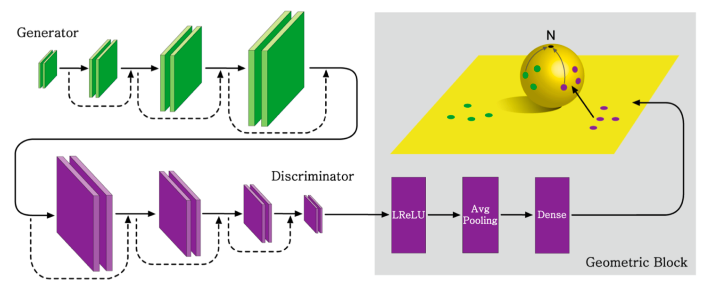
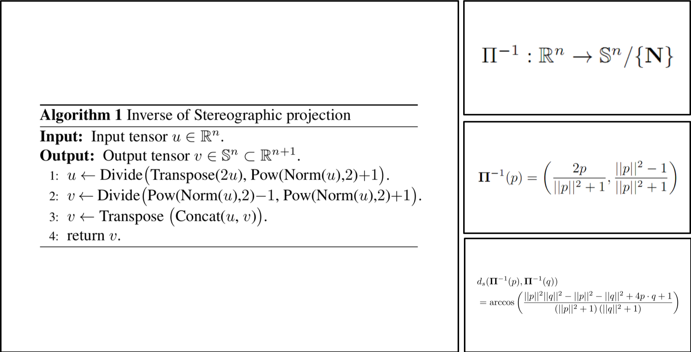
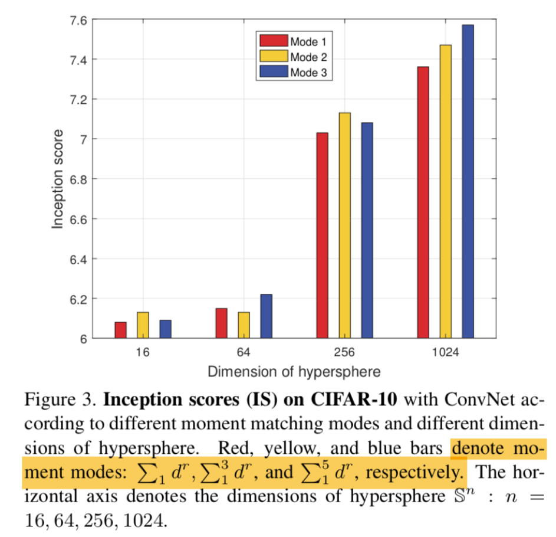
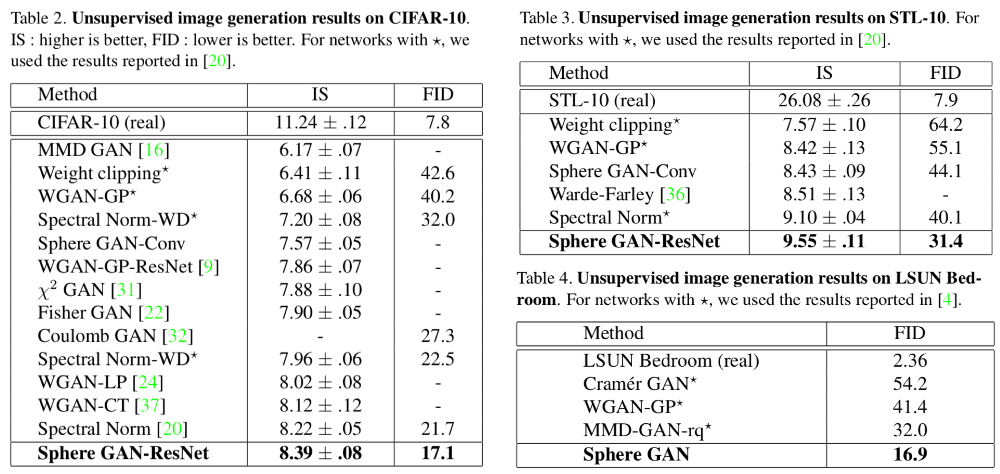
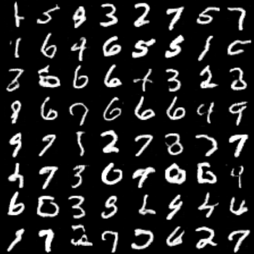
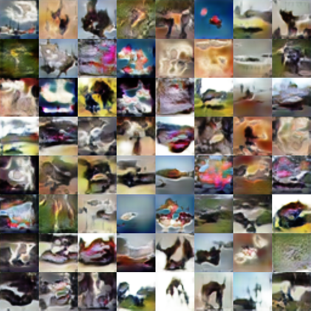
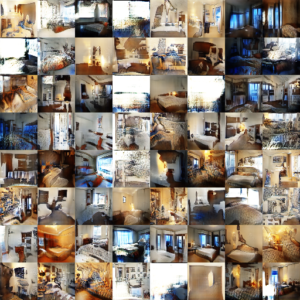
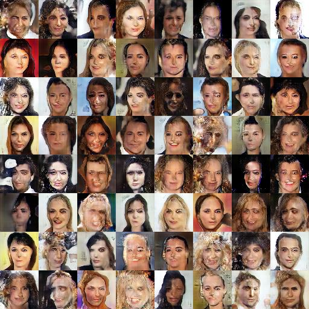

# SphereGAN-Tensorflow
Simple Tensorflow implementation of SphereGAN (CVPR 2019 Oral) | [paper](http://cau.ac.kr/~jskwon/paper/SphereGAN_CVPR2019.pdf) | [supplementary materials](http://cau.ac.kr/~jskwon/paper/SphereGAN_CVPR2019_SUPP.pdf)

<div align="center">
  
</div>

## Usage
* `mnist` and `cifar10` are used inside keras
* For `your dataset`, put images like this:
```
├── dataset
   └── YOUR_DATASET_NAME
       ├── xxx.jpg (name, format doesn't matter)
       ├── yyy.png
       └── ...
```

### Train
```
> python main.py --dataset mnist --gan_type sphere --phase train
```

### Random test
```
> python main.py --dataset mnist --gan_type sphere --phase test
```

## Analysis
###  Inverse of stereographic projection


### Moment mode


## Results
### Score


### Image (64x64)
* The paper only posted the results for `32x32 images`, but I also tried `64x64`
#### Mnist


#### Cifar10


#### Lsun bedroom


#### CelebA


## Author
Junho Kim
